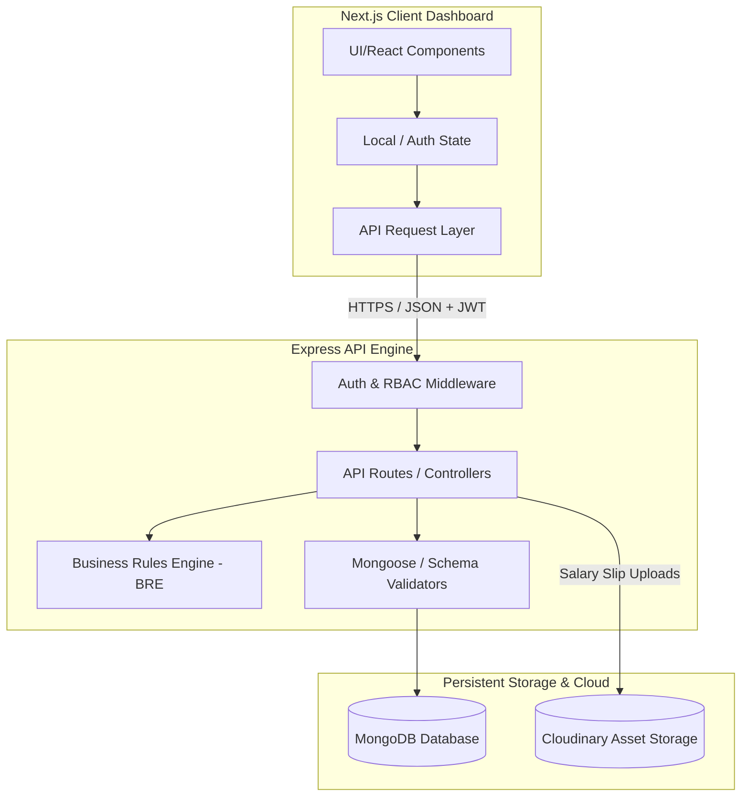
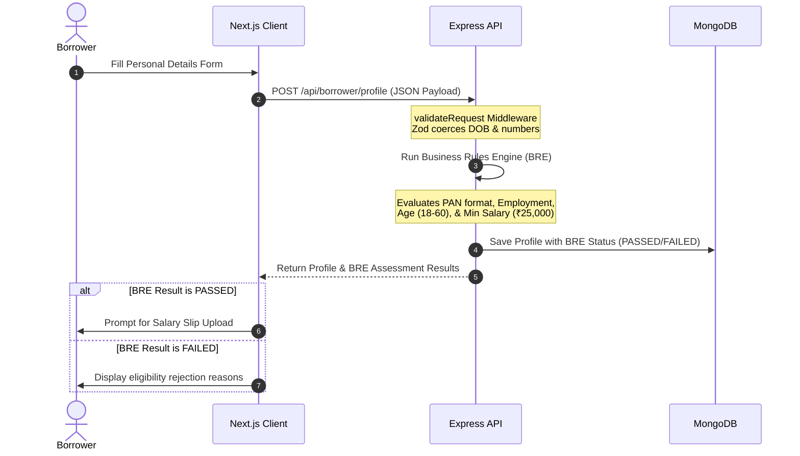
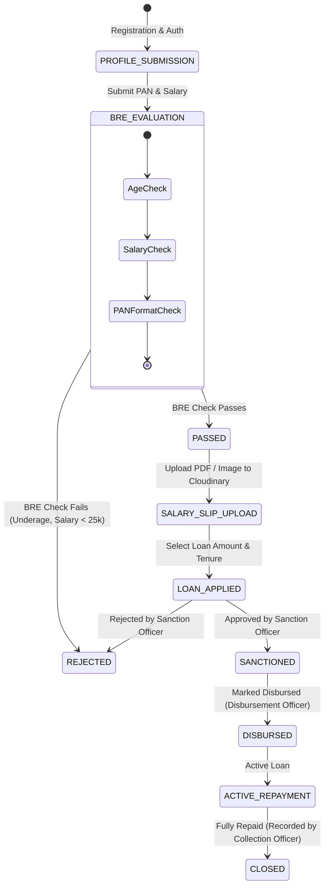

# 🏦 LendFlow: Enterprise Loan Management System

LendFlow is a robust, full-stack, enterprise-grade **Loan Management System (LMS)** designed with role-based access control (RBAC), a dynamic Business Rules Engine (BRE), and automated status workflows. Built using a modern MERN architecture (**Next.js**, **Express**, **TypeScript**, and **MongoDB**), LendFlow manages the entire loan lifecycle from borrower eligibility analysis to collection tracking and automated ledger settlement.

---

## 🏗️ System Architecture

LendFlow divides operations cleanly between an optimized, type-safe REST API server and a responsive Next.js SPA dashboard.



---

## 📈 Logical Workflow & Loan Lifecycle

The LendFlow platform orchestrates complex processes through automated state transition constraints:

### 1. Registration, Profile & BRE Validation Flow


### 2. Loan Progression State Machine


---

## 🔐 Role-Based Access Control (RBAC)

LendFlow implements secure, multi-tier RBAC enforced at both the Frontend (UI router protection) and Backend (controller-level middleware):

| Role | Key Permissions & Responsibilities | Accessible Modules |
| :--- | :--- | :--- |
| **`BORROWER`** | Fill eligibility form, upload salary slips, apply for loans, view active repayments. | Profile, Upload Documents, Loan Application, My Loans |
| **`SALES`** | View all customer applications, monitor entry-level pipelines. | Sales Dashboard View |
| **`SANCTION`**| Review documents, perform underwriting risk checks, Approve/Reject applications. | Sanction Underwriting Panel |
| **`DISBURSEMENT`** | Manage treasury operations, disburse approved loans, update banking references. | Disbursement Board |
| **`COLLECTION`** | Record repayment installments, view customer balances, reconcile loan accounts. | Collections & Recovery Panel |
| **`ADMIN`** | Complete systems overview. Can override workflows, configure default rules, and view all dashboards. | Unified Administrator Portal |

---

## ⚙️ Business Rules Engine (BRE) Criteria

When a borrower completes their profile, the **BRE** evaluates eligibility against the following strict parameters:
- **Age Bounds:** The applicant's age must be between **18** and **60** years (computed dynamically using UTC year offsets).
- **Minimum Income:** Minimum monthly salary must be **₹25,000**.
- **Employment Stability:** Applicant must not be **UNEMPLOYED** (Salaried and Self-Employed modes are accepted).
- **PAN Verification:** PAN number must match the regular expression format `^[A-Z]{5}[0-9]{4}[A-Z]$`.

---

## 📂 Project Directory Structure

```txt
LMS/
├── Backend/                 # Express API Engine
│   ├── src/
│   │   ├── config/          # DB connection & external configs
│   │   ├── constants/       # Global constants (Loan limits, BRE terms)
│   │   ├── controllers/     # Route controller endpoints
│   │   ├── middleware/      # Auth, RBAC, File Upload, & Zod validators
│   │   ├── models/          # Mongoose database models
│   │   ├── routes/          # Express API route endpoints
│   │   ├── seed/            # Development database seed script
│   │   ├── services/        # BRE, Cloudinary, & Math logic modules
│   │   ├── types/           # TS Interfaces & Request overrides
│   │   └── utils/           # Error classes & helpers
│   ├── package.json
│   └── tsconfig.json
│
├── Frontend/                # Next.js SPA
│   ├── app/                 # Next.js App Router (Layouts & Pages)
│   ├── components/          # Reusable Tailwind UI components
│   ├── lib/                 # Client utilities (HTTP client, session helper)
│   ├── tailwind.config.ts
│   └── tsconfig.json
```

---

## 🚀 Installation & Local Setup

### Prerequisites
- [Node.js v18+](https://nodejs.org/)
- [MongoDB Community Server](https://www.mongodb.com/try/download/community) running locally, or an Atlas Cluster URL.

---

### Step 1: Backend Setup

1. Navigate to the backend directory and install dependencies:
   ```bash
   cd Backend
   npm install
   ```

2. Copy the environment variables template:
   ```bash
   cp .env.example .env
   ```

3. Configure your local variables inside `Backend/.env`:
   ```env
   PORT=5000
   MONGO_URI=mongodb://127.0.0.1:27017/lms
   JWT_SECRET=generate_your_long_secure_secret_here
   JWT_EXPIRES_IN=7d
   CLIENT_URL=http://localhost:3000,http://localhost:3001
   
   # Cloudinary credentials for salary slips
   CLOUDINARY_CLOUD_NAME=your_cloudinary_cloud_name
   CLOUDINARY_API_KEY=your_cloudinary_api_key
   CLOUDINARY_API_SECRET=your_cloudinary_api_secret
   ```

4. Seed the database with default role credentials:
   ```bash
   npm run seed
   ```

5. Launch the development server:
   ```bash
   npm run dev
   ```
   *The backend will boot up at `http://localhost:5000`.*

---

### Step 2: Frontend Setup

1. Open a new terminal in the frontend directory and install dependencies:
   ```bash
   cd Frontend
   npm install
   ```

2. Setup environment variables:
   ```bash
   cp .env.example .env.local
   ```

3. Ensure the API endpoint matches in `Frontend/.env.local`:
   ```env
   NEXT_PUBLIC_API_URL=http://localhost:5000/api
   ```

4. Start the next dev server:
   ```bash
   npm run dev
   ```
   *The client interface will start at `http://localhost:3000`.*

---

## 🔑 Seed Logins

The database seed command generates test accounts with predefined roles and passwords (`Password: Role@123` format):

| Role | Email | Password |
| :--- | :--- | :--- |
| **`ADMIN`** | `admin@lms.com` | `Admin@123` |
| **`SALES`** | `sales@lms.com` | `Sales@123` |
| **`SANCTION`** | `sanction@lms.com` | `Sanction@123` |
| **`DISBURSEMENT`** | `disbursement@lms.com` | `Disbursement@123` |
| **`COLLECTION`** | `collection@lms.com` | `Collection@123` |
| **`BORROWER`** | `borrower@lms.com` | `Borrower@123` |

---

## 🧪 Key API Endpoint Overview

All API endpoints (except public auth paths) require standard Bearer token authorization headers: `Authorization: Bearer <JWT_TOKEN>`.

### Authentication
- `POST /api/auth/register` — Standard registration (primarily for Borrowers).
- `POST /api/auth/login` — Verifies credentials, returns JWT tokens and user metadata.

### Borrower Actions
- `POST /api/borrower/profile` — Upserts borrower personal details and triggers BRE.
- `GET /api/borrower/profile` — Retrieves the active borrower's BRE status.
- `POST /api/borrower/salary-slip` — Uploads salary slip (Multipart upload to Cloudinary).
- `POST /api/borrower/loans` — Creates new loan application if profile has passed the BRE check.
- `GET /api/borrower/loans` — Lists all loans associated with the active borrower.

### Staff Actions
- `GET /api/dashboard/applications` — Retrieves active customer applications filtered by context.
- `PATCH /api/dashboard/loans/:id/status` — State-transition operations (Approvals, Disbursements, Repayments).
